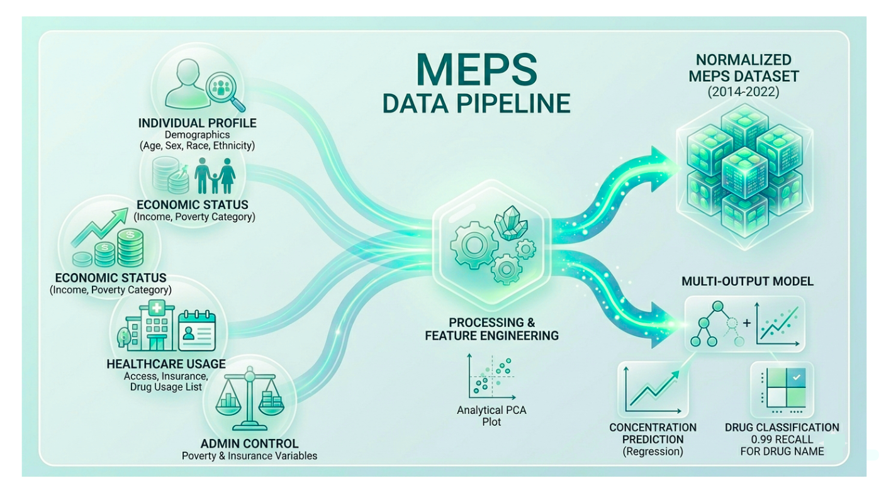
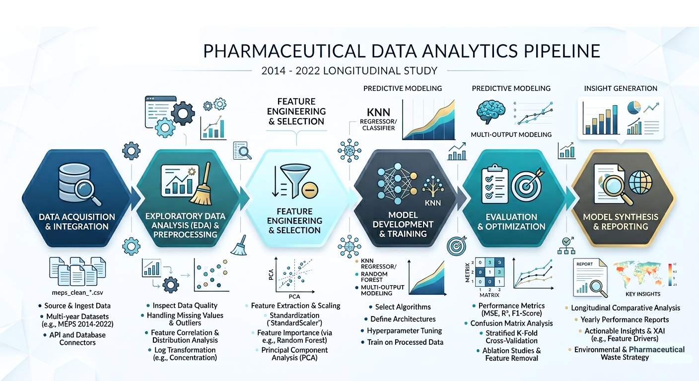
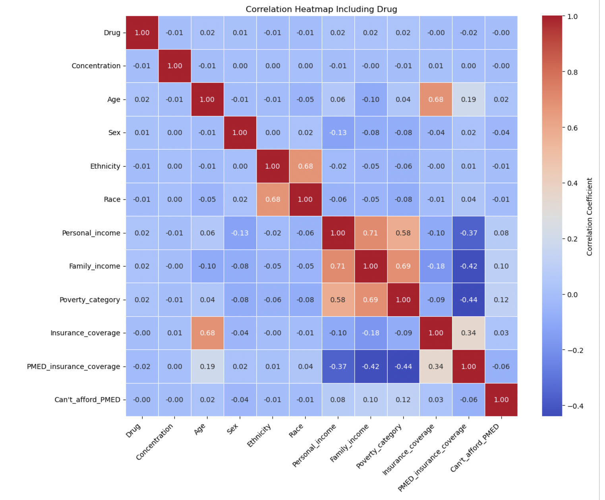
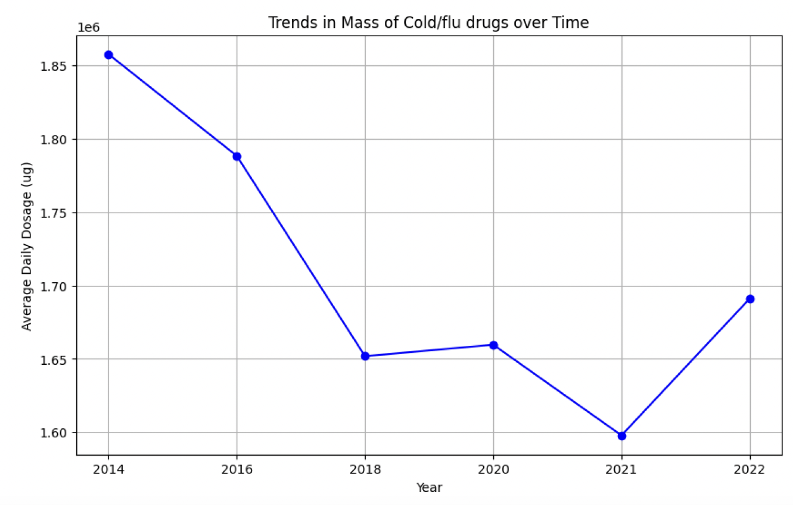
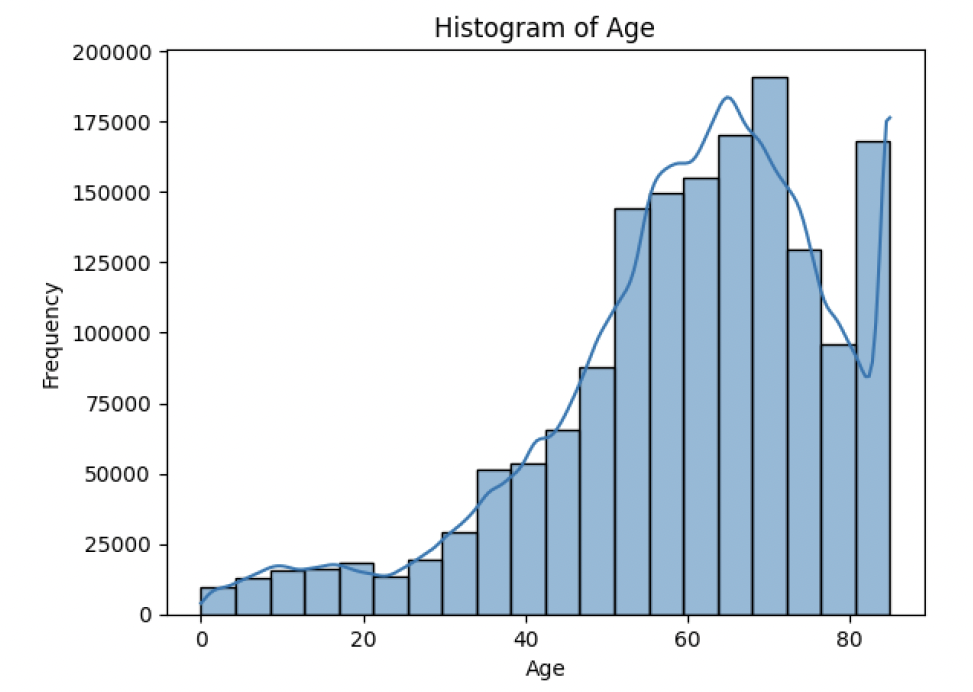

# Statistical Learning of Socioeconomic Drivers in Environmental Health Systems

## Overview

This project studies how demographic and socioeconomic factors influence patterns in pharmaceutical usage and derived environmental indicators. Using multi-year MEPS data, the analysis focuses on identifying relationships between population characteristics (income, insurance, age, etc.) and outcomes such as drug usage patterns and estimated concentration proxies.

The work combines exploratory data analysis with multi-output machine learning models to jointly predict drug identity and concentration-related variables.

## Data

  

The analysis is based on the Medical Expenditure Panel Survey (MEPS), a nationally representative dataset capturing individual-level healthcare usage, expenditures, and socioeconomic conditions across the United States.

The diagram above illustrates how multiple data components were combined to form a unified analytical dataset. Information from prescription records, demographic attributes, and socioeconomic indicators was integrated to enable population-level modeling.

### Core Variables

The final dataset includes the following categories of features:

- **Demographic attributes:**  
  Age, sex, race, and ethnicity  

- **Socioeconomic indicators:**  
  Personal income, family income, and poverty category  

- **Healthcare access variables:**  
  Insurance coverage and access to prescribed medication  

- **Prescription-related features:**  
  Drug identity, dosage-related attributes, and usage patterns  

### Addiitonal Feature Added

To support modeling, additional variables were derived from the raw data:

- Daily dosage calculated from prescription attributes  
- Concentration proxies representing estimated environmental impact  
- Encoded categorical variables for model compatibility  

The integrated dataset was then cleaned, standardized, and aligned across years to ensure consistency for downstream analysis.

## Modeling Approach

### Project Workflow

  

The diagram above reflects the sequence of steps followed throughout the project, from data preparation to model evaluation.

#### Data Preparation and Integration

- MEPS data was cleaned by removing missing, inconsistent, and invalid records  
- Demographic, socioeconomic, and prescription-related variables were combined into a unified dataset  
- Derived features such as **daily dosage** and **concentration proxies** were constructed to better represent drug usage patterns  

#### Exploratory Analysis and Feature Processing

- Exploratory data analysis was performed to examine:
  - variable distributions  
  - correlations between features  
  - temporal trends across years  

- Categorical variables (e.g., race, ethnicity, insurance coverage) were encoded into numerical representations  
- Features were standardized to ensure consistency for distance-based models such as KNN  

#### Problem Formulation

The task was formulated as a **multi-output prediction problem**, where the model simultaneously predicts:

- **Regression:** concentration-related values  
- **Classification:** drug identity  

#### Model Development

The following models were implemented:

- Multi-output K-Nearest Neighbors (KNN)  
- KNN with PCA-based dimensionality reduction  

PCA was introduced to reduce feature dimensionality and evaluate its effect on model performance.

#### Model Evaluation

Model performance was evaluated using:

- Classification metrics: accuracy, F1-score, recall  
- Regression metrics: mean squared error (MSE), R²  

Results were compared across models to determine the most effective approach for each prediction task.

## Visual Analysis

### Correlation Structure Across Features

  

The correlation matrix shows strong relationships among socioeconomic variables. In particular, personal income, family income, and poverty category form a tightly correlated group, while insurance-related variables exhibit inverse relationships with poverty indicators. These structures directly influenced feature selection and model behavior.

### Temporal Trends in Drug Usage

  

This plot tracks changes in average dosage over time. The noticeable drop around 2018–2021 followed by recovery suggests non-stationary behavior in the data. These temporal shifts make prediction more challenging and explain variability in model performance across years.

### Demographic Distribution

  

The age distribution is skewed toward middle-aged and older populations, which aligns with higher healthcare utilization patterns. This imbalance is important for interpreting predictions, as the model is naturally more influenced by these dominant age groups.

## Results

The study evaluated multiple modeling approaches, including linear regression, logistic regression, random forest, multi-output KNN with PCA, and multi-output decision trees, to predict both drug identity and concentration-related outcomes.

Overall, model performance varied significantly across tasks:

- **Drug prediction (classification):**  
  The multi-output K-Nearest Neighbors (KNN) model achieved the strongest performance, with very high recall (approximately 0.99). This indicates that instance-based methods were effective in capturing similarities in demographic and socioeconomic profiles associated with specific drugs.

- **Concentration prediction (regression / categorical levels):**  
  The multi-output decision tree model performed best for predicting concentration levels, achieving recall around 0.87. Tree-based methods were better suited for capturing nonlinear relationships between socioeconomic variables and concentration categories.

- **Linear and logistic regression models:**  
  These models showed consistently low performance, with near-zero or negative R² values for regression and low classification accuracy. This suggests that linear assumptions are insufficient to model the complexity of the relationships in the data.

- **Random forest model:**  
  Performance improved notably after feature reduction. In particular, removing less informative variables while retaining socioeconomic features led to a 34–36% improvement in accuracy, indicating the strong influence of these variables.

Across all models, **socioeconomic features (income, insurance coverage, poverty category)** emerged as key contributors to predictive performance, reinforcing their importance in understanding pharmaceutical patterns.

Additionally, temporal analysis showed that overall pharmaceutical concentrations generally decreased between 2014 and 2022, with variations across specific drug categories. These trends highlight the dynamic nature of the data and the need for models that can account for temporal shifts.

In summary:

- KNN-based models were most effective for **drug prediction**  
- Decision tree models were most effective for **concentration prediction**  
- Socioeconomic variables played a central role across all modeling approaches

  ## Code

Notebooks:

- [EDA Notebook](src/notebooks/eda_population_analysis.ipynb) / [Viewable EDA Analysis Code](src/notebooks_pdf/eda_population_analysis.pdf)
- [KNN Notebook](src/notebooks/knn_multioutput_model.ipynb)  / [Viewable KNN Multi-output Model](src/notebooks_pdf/knn_multioutput_model.pdf) 
- [KNN + PCA Notebook](src/notebooks/knn_pca_multioutput_model.ipynb) / [Viewable KNN + PCA Model](src/notebooks_pdf/knn_pca_multioutput_model.pdf)  

Full report:

- [Project Report](report/Environmental_Health_Modeling_Report.pdf)

## Future Work

- Improve classification reliability by addressing class imbalance and evaluating macro-averaged metrics, ensuring that performance is not dominated by frequently occurring drugs while underrepresenting rare categories  

- Enhance regression performance for concentration prediction by refining feature construction and exploring transformations that better capture nonlinear relationships  

- Extend modeling approaches beyond KNN and decision trees to include methods that can better handle high-dimensional and imbalanced data  

- Incorporate temporal structure explicitly, as observed trends across years suggest non-stationary behavior that current models do not fully capture  

- Perform deeper model evaluation using class-wise metrics and confusion analysis to better understand performance across individual drug categories rather than relying on aggregated scores  
