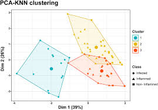
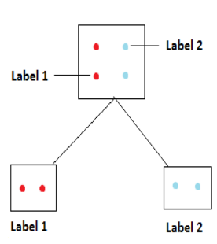

# Statistical Learning of Socioeconomic Drivers in Environmental Health Systems

## Overview

This project studies how demographic and socioeconomic factors influence patterns in pharmaceutical usage and derived environmental indicators. Using multi-year MEPS data, the analysis focuses on identifying relationships between population characteristics (income, insurance, age, etc.) and outcomes such as drug usage patterns and estimated concentration proxies.

The work combines exploratory data analysis with multi-output machine learning models to jointly predict drug identity and concentration-related variables.

## Data

  

The analysis is based on the Medical Expenditure Panel Survey (MEPS), a nationally representative dataset capturing individual-level healthcare usage, expenditures, and socioeconomic conditions across the United States.

The diagram above illustrates how multiple data components were combined to form a unified analytical dataset. Information from prescription records, demographic attributes, and socioeconomic indicators was integrated to enable population-level modeling.

### Core Variables

The final dataset includes the following categories of features:

- **Demographic attributes:**  
  Age, sex, race, and ethnicity  

- **Socioeconomic indicators:**  
  Personal income, family income, and poverty category  

- **Healthcare access variables:**  
  Insurance coverage and access to prescribed medication  

- **Prescription-related features:**  
  Drug identity, dosage-related attributes, and usage patterns  

### Addiitonal Feature Added

To support modeling, additional variables were derived from the raw data:

- Daily dosage calculated from prescription attributes  
- Concentration proxies representing estimated environmental impact  
- Encoded categorical variables for model compatibility  

The integrated dataset was then cleaned, standardized, and aligned across years to ensure consistency for downstream analysis.

## Modeling Approach

### Project Workflow

  

The diagram above reflects the sequence of steps followed throughout the project, from data preparation to model evaluation.

#### Data Preparation and Integration

- MEPS data was cleaned by removing missing, inconsistent, and invalid records  
- Demographic, socioeconomic, and prescription-related variables were combined into a unified dataset  
- Derived features such as **daily dosage** and **concentration proxies** were constructed to better represent drug usage patterns  

#### Exploratory Analysis and Feature Processing

- Exploratory data analysis was performed to examine:
  - variable distributions  
  - correlations between features  
  - temporal trends across years  

- Categorical variables (e.g., race, ethnicity, insurance coverage) were encoded into numerical representations  
- Features were standardized to ensure consistency for distance-based models such as KNN  

#### Problem Formulation

The task was formulated as a **multi-output prediction problem**, where the model simultaneously predicts:

- **Regression:** concentration-related values  
- **Classification:** drug identity  

#### Model Development

The following models were implemented:

- Multi-output K-Nearest Neighbors (KNN)  
- KNN with PCA-based dimensionality reduction  

PCA was introduced to reduce feature dimensionality and evaluate its effect on model performance.

#### Model Evaluation

Model performance was evaluated using:

- Classification metrics: accuracy, F1-score, recall  
- Regression metrics: mean squared error (MSE), R²  

Results were compared across models to determine the most effective approach for each prediction task.

## Data Visualization 

### Correlation Structure Across Features

<table>
<tr>
<td width="50%">

The correlation matrix highlights clear structure among socioeconomic variables. Personal income, family income, and poverty category form a tightly related group, indicating strong overlap in economic indicators. 

Insurance-related variables show inverse relationships with poverty, suggesting differences in healthcare access across income levels. These patterns guided feature selection and influenced how models captured relationships in the data.

</td>
<td width="50%">

</td>
</tr>
</table>

### Temporal Trends in Drug Usage

<table>
<tr>
<td width="50%">

The temporal trend analysis reveals non-uniform behavior across years. A noticeable decline in dosage levels between 2018 and 2021, followed by recovery, indicates shifts in underlying usage patterns.

This non-stationarity introduces additional complexity for modeling, as relationships between features and outcomes are not consistent over time.

</td>
<td width="50%">

</td>
</tr>
</table>

### Demographic Distribution

<table>
<tr>
<td width="50%">

The age distribution is skewed toward middle-aged and older populations, reflecting higher healthcare utilization in these groups.

This imbalance is important when interpreting results, as model predictions are naturally influenced more by these dominant segments of the dataset.

</td>
<td width="50%">

</td>
</tr>
</table>

## Results

## Results

The models were evaluated across both classification (drug prediction) and regression (concentration estimation) tasks. Performance varied across approaches, with different models performing better depending on the objective.

---

### KNN Model (Multi-output)

<table>
<tr>
<td width="50%">

The K-Nearest Neighbors model performed strongly for drug classification, achieving high recall and consistency across common drug categories. 

Because KNN relies on similarity in feature space, it was effective in capturing patterns among individuals with similar demographic and socioeconomic profiles. This made it particularly suitable for identifying drug usage patterns.

However, its performance was more limited for continuous prediction tasks, especially when relationships between variables were more complex or nonlinear.

</td>
<td width="50%">

</td>
</tr>
</table>

---

### Decision Tree Model

<table>
<tr>
<td width="50%">

The decision tree model performed better for concentration prediction, where relationships between variables were less linear and more hierarchical in nature.

Tree-based splitting allowed the model to capture interactions between socioeconomic factors such as income, insurance coverage, and poverty category. This made it more effective for modeling concentration-related outcomes compared to distance-based methods.

</td>
<td width="50%" align="center">

</td>
</tr>
</table>
---

### Overall Observations

- KNN was more effective for classification tasks involving drug prediction  
- Decision trees handled nonlinear relationships better for concentration estimation  
- Linear models struggled to capture the structure in the data  
- Socioeconomic variables consistently contributed strong predictive signal  

The results suggest that model choice should depend on the nature of the prediction task, particularly whether relationships are similarity-based or nonlinear.

  ## Code

Notebooks:

- [EDA Notebook](src/notebooks/eda_population_analysis.ipynb) / [Viewable EDA Analysis Code](src/notebooks_pdf/eda_population_analysis.pdf)
- [KNN Notebook](src/notebooks/knn_multioutput_model.ipynb)  / [Viewable KNN Multi-output Model](src/notebooks_pdf/knn_multioutput_model.pdf) 
- [KNN + PCA Notebook](src/notebooks/knn_pca_multioutput_model.ipynb) / [Viewable KNN + PCA Model](src/notebooks_pdf/knn_pca_multioutput_model.pdf)  

Full report:

- [Project Report](report/Environmental_Health_Modeling_Report.pdf)

## Future Work

- Improve classification reliability by addressing class imbalance and evaluating macro-averaged metrics, ensuring that performance is not dominated by frequently occurring drugs while underrepresenting rare categories  

- Enhance regression performance for concentration prediction by refining feature construction and exploring transformations that better capture nonlinear relationships  

- Extend modeling approaches beyond KNN and decision trees to include methods that can better handle high-dimensional and imbalanced data  

- Incorporate temporal structure explicitly, as observed trends across years suggest non-stationary behavior that current models do not fully capture  

- Perform deeper model evaluation using class-wise metrics and confusion analysis to better understand performance across individual drug categories rather than relying on aggregated scores  
